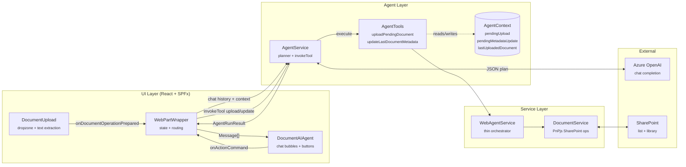
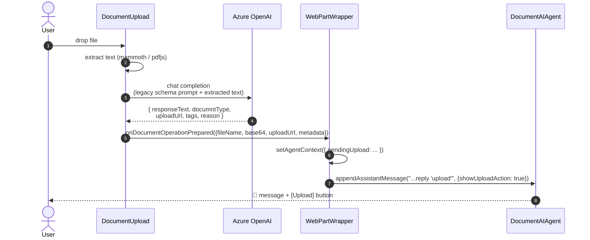
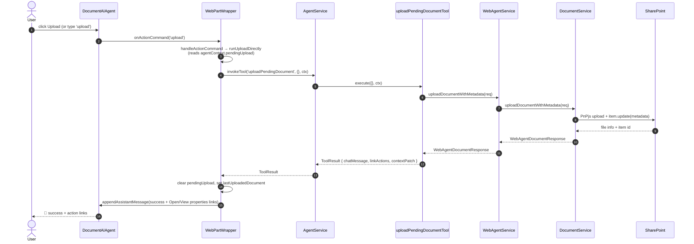
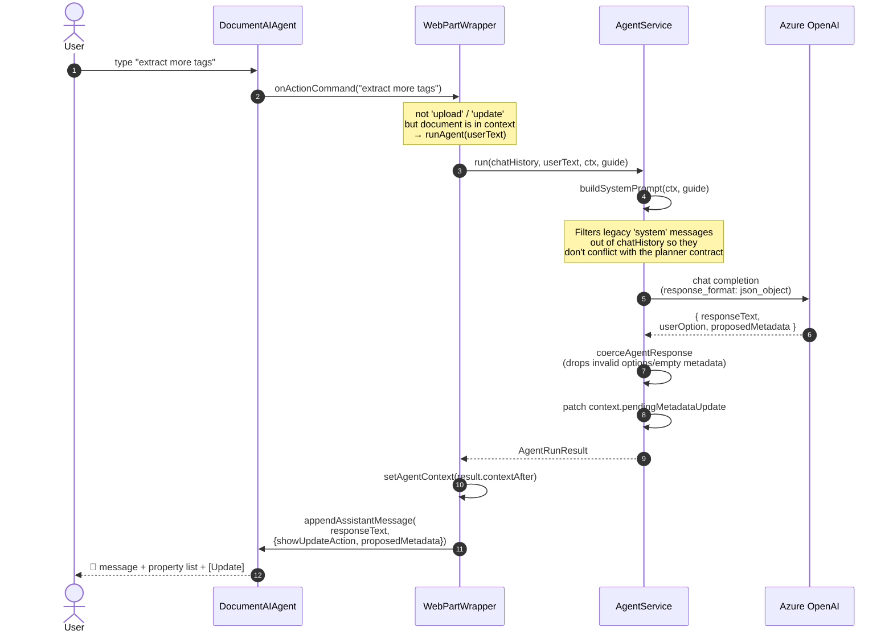
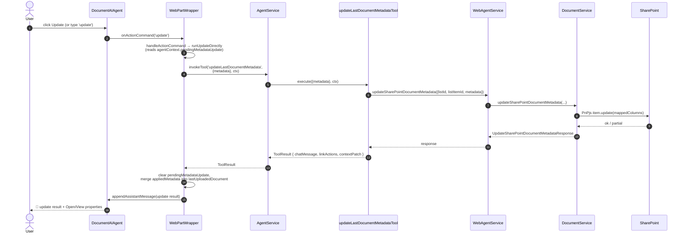
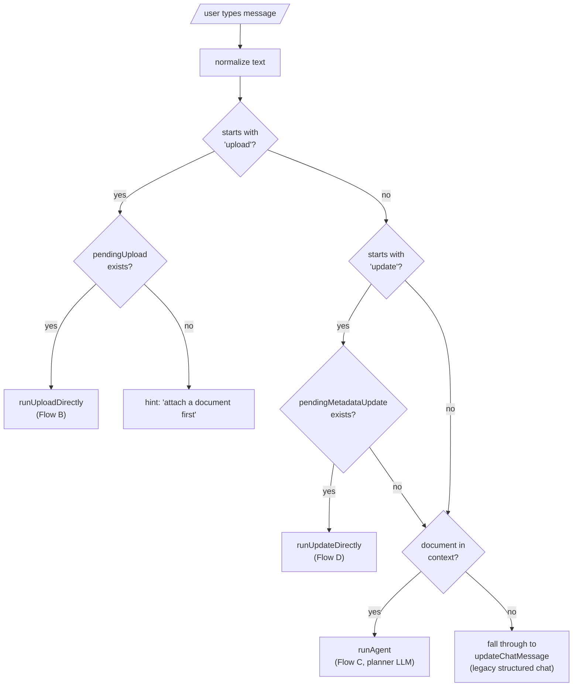
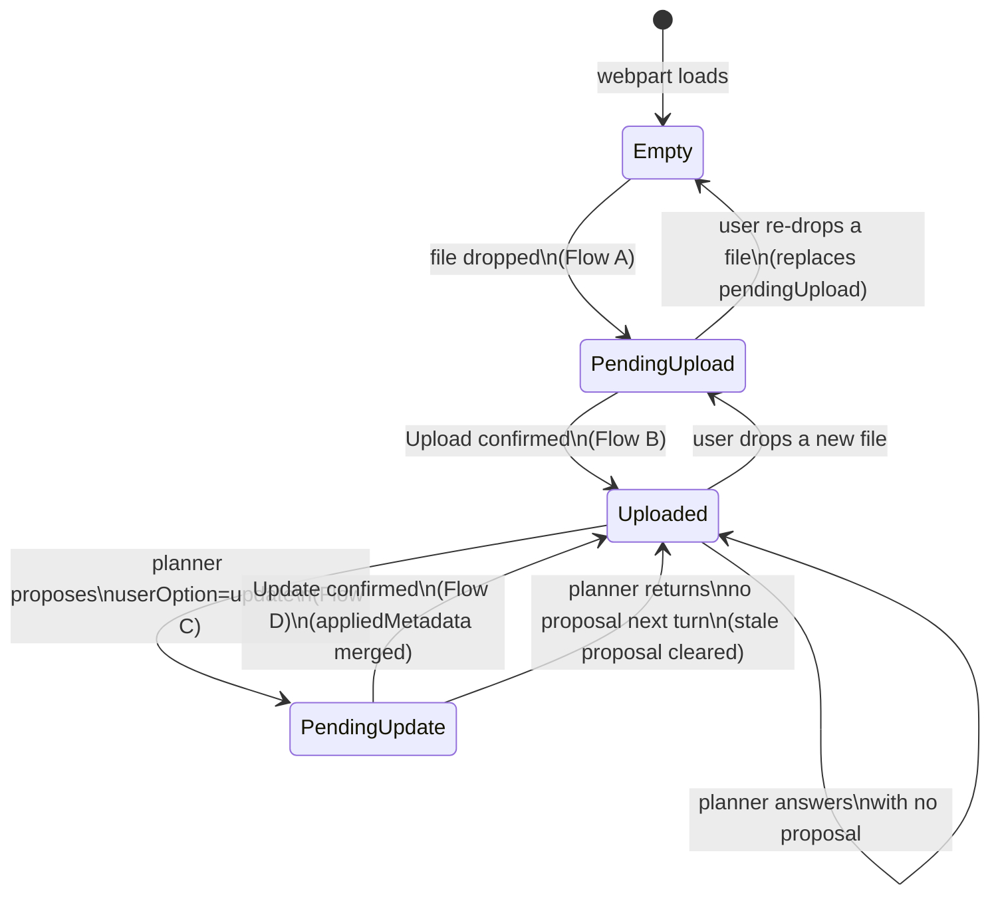
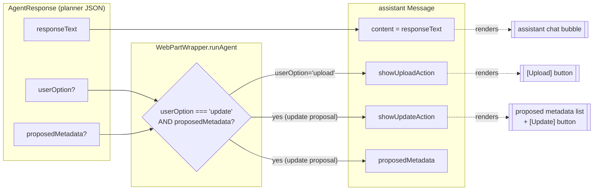

# Prompt & Document Flow

This document describes how a user's input flows through the SPFx web part, the planner agent, and SharePoint, ending in either an uploaded document or an updated metadata record.

All diagrams use [Mermaid](https://mermaid.js.org/) and render natively in GitHub, VS Code (with the Markdown preview extension), and Cursor.

---

## 1. High-level architecture



### Roles in one line each

| Component | Responsibility |
|---|---|
| `DocumentUpload` | Read the dropped file, extract text, ask Azure OpenAI for structured analysis, hand off a `pendingUpload` to `WebPartWrapper`. |
| `WebPartWrapper` | Owns chat state and `AgentContext`. Routes user input to the right path (fast-path tool, planner agent, or legacy chat). |
| `DocumentAIAgent` | Renders chat bubbles and confirmation buttons (Upload / Update); emits `onActionCommand`. |
| `AgentService` | Calls Azure OpenAI as a **planner** with a strict JSON contract; also exposes `invokeTool` for direct execution. |
| `AgentTools` | Concrete actions (`uploadPendingDocument`, `updateLastDocumentMetadata`) that call `WebAgentService`. |
| `WebAgentService` | Top-level service orchestrator. Currently dispatches to `DocumentService`. |
| `DocumentService` | All SharePoint document I/O via PnPjs. |

---

## 2. End-to-end lifecycle (drop → upload → propose → update)

```mermaid
flowchart TD
    Start([User drops a file]) --> Analyze["DocumentUpload<br/>extracts text + asks AOAI<br/>for documntType / uploadUrl / tags"]
    Analyze --> Pending["AgentContext.pendingUpload set<br/>chat shows <b>Upload</b> button"]
    Pending -->|click Upload<br/>or type 'upload'| FastUpload["runUploadDirectly<br/>→ invokeTool('uploadPendingDocument')"]
    FastUpload --> SP1[(SharePoint)]
    SP1 --> Uploaded["AgentContext.lastUploadedDocument set<br/>chat shows success +<br/>Open document / View properties"]

    Uploaded -->|free-text chat<br/>e.g. 'extract more tags'| Planner["runAgent →<br/>AgentService.run<br/>(planner LLM call)"]
    Planner -->|userOption='update'<br/>+ proposedMetadata| Proposal["AgentContext.pendingMetadataUpdate set<br/>chat shows property list +<br/><b>Update</b> button"]
    Proposal -->|click Update<br/>or type 'update'| FastUpdate["runUpdateDirectly<br/>→ invokeTool('updateLastDocumentMetadata')"]
    FastUpdate --> SP2[(SharePoint)]
    SP2 --> Updated["lastUploadedDocument.appliedMetadata merged<br/>chat shows update result"]
    Updated -.next turn.-> Planner

    Planner -->|userOption=null<br/>(answer / clarification)| Answer["chat shows responseText only"]
    Answer -.-> Planner
```

The same loop applies for any number of follow-up turns. Each user message either:

1. Triggers a **fast path** (`upload` / `update` confirms a pending proposal), or
2. Goes to the **planner**, which may produce a new proposal or just answer.

---

## 3. Flow A — Document analysis (drop a file)

This is the only path that still uses the **legacy structured-response prompt** (the schema with `documntType`, `uploadUrl`, `tags`, `reason`). It runs once per dropped file.



> The legacy system message lives in `WebPartWrapper`'s initial `chatMessages` and is **filtered out** of every planner call (see Flow C).

---

## 4. Flow B — Confirm upload (click **Upload** or type `upload`)



The fast path **skips the LLM** — clicking Upload is deterministic.

---

## 5. Flow C — Planner agent (chat after a document is in context)

This is the heart of the new architecture. The LLM acts purely as a **planner**, never an executor.



### Planner JSON contract

```json
{
  "responseText": "Here are some HR-related tags I extracted.",
  "userOption": "update",
  "proposedMetadata": {
    "Tags": "HR, Recruitment, Training",
    "DocumentCategory": "Human Resources"
  }
}
```

- `userOption` is one of `"upload"`, `"update"`, or absent.
- `proposedMetadata` is required when `userOption === "update"` and must be a non-empty `Record<string, string>`.
- The orchestrator validates the shape; malformed proposals are silently downgraded to a plain `responseText` so the user is never offered a broken button.

---

## 6. Flow D — Confirm metadata update (click **Update** or type `update`)



Like Upload, this fast path skips the LLM. The proposal stored from Flow C is the source of truth for *what* gets applied.

---

## 7. Routing decisions inside `WebPartWrapper.handleActionCommand`



The decision is intentionally simple: **fast paths first, then planner, then legacy chat**. Every branch is exercised by the diagrams above.

---

## 8. `AgentContext` lifecycle

`AgentContext` is the single source of truth that survives across turns. Its states drive which buttons appear in the UI.



Key invariants enforced in code:

- **Only one `pendingMetadataUpdate` at a time.** A new turn without `userOption: "update"` clears the old proposal so the Update button can't linger over a stale proposal.
- **`pendingUpload` is cleared when the upload tool succeeds**, and `lastUploadedDocument` is set in the same `contextPatch`.
- **`lastUploadedDocument.appliedMetadata` is *merged* on update**, never replaced — so partial updates accumulate.

---

## 9. UI signals from `AgentResponse` to `Message`



This is the contract between the planner and the UI: the planner only describes *intent*; the wrapper translates that into concrete UI affordances on the `Message`, and `DocumentAIAgent` renders them.

---

## 10. Quick reference: where each flow lives

| Flow | Entry point | Key code |
|---|---|---|
| A — Analyze | `DocumentUpload.onDrop` | `DocumentUpload.tsx`, `AzureAIService.sendMessageToAzureAI` |
| B — Upload (fast path) | `WebPartWrapper.runUploadDirectly` | `AgentService.invokeTool` → `uploadPendingDocumentTool` → `DocumentService.uploadDocumentWithMetadata` |
| C — Planner chat | `WebPartWrapper.runAgent` | `AgentService.run` (planner LLM call + `coerceAgentResponse`) |
| D — Update (fast path) | `WebPartWrapper.runUpdateDirectly` | `AgentService.invokeTool` → `updateLastDocumentMetadataTool` → `DocumentService.updateSharePointDocumentMetadata` |
| Legacy chat | `WebPartWrapper.updateChatMessage` | Used only when no document is in context |
